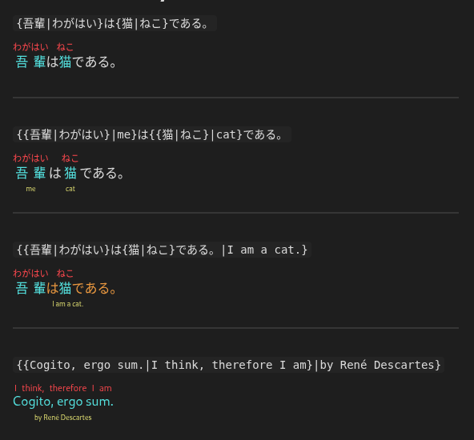

Advanced Ruby is a flexible ruby annotation plugin for Obsidian.
It renders `{base|ruby}` syntax into semantic `<ruby><rt>` tags in reading mode—without modifying your notes.
While commonly used for CJK text, it works with any characters, making it suitable for phonetic guides, semantic glosses, or layered annotations across languages and notes.

It supports nested ruby, exposes granular styling via the Style Settings plugin (up to two layers), and includes a command to wrap selected text.

## Features

- Fast, recursive parsing
- Skips code blocks and preformatted sections
- Command to wrap selected text in ruby syntax
- Granular styling via Style Settings (up to two layers)
- Non-destructive rendering
- Handles complex nested markup

## Design choices

- Markdown and HTML inside ruby annotations are not supported
- Live Preview is not supported
	- To preview ruby while editing, open a second pane in reading mode
