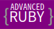
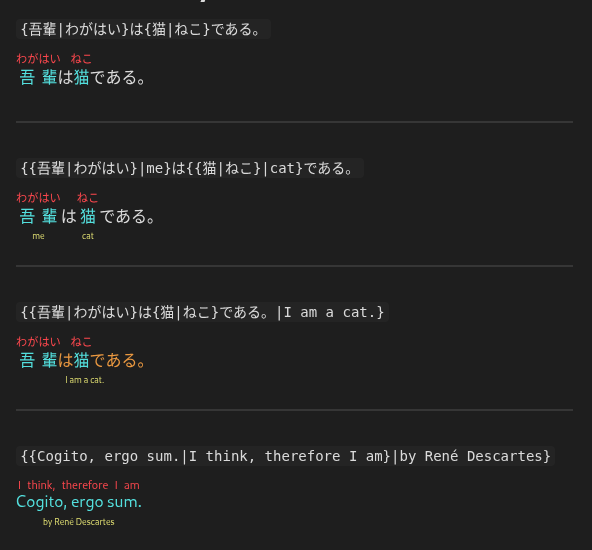

---

Advanced Ruby enables complex, language-independent ruby annotation rendering and editing for [Obsidian](https://github.com/obsidianmd).

While ruby is commonly used to show the pronunciation of Japanese and other East Asian characters, it can be used to annotate any kind of text.

This plugin supports the full range of Unicode, making it suitable not only for phonetic guides but also for semantic glosses or layered annotations.

It renders Markdown ruby syntax (`{base|ruby}`) as HTML ruby tags (`<ruby>base<rt>ruby</rt></ruby>`) without modifying your notes.

In editing mode, you can insert Markdown ruby wrappers and convert between Markdown and HTML ruby syntaxes.

## Features

- Fast and efficient parsing
- Code block skipping
- Command to wrap selected text in ruby syntax or insert an empty wrapper
- Context menu option for wrapping selected text
- Command to convert between Markdown and HTML ruby syntaxes
- Touch support for mobile
- Granular style customization via the [Obsidian Style Settings Plugin](https://github.com/mgmeyers/obsidian-style-settings) (up to two layers)
- Non-destructive rendering
- Support for complex nested markup
- Intuitive UI

## How to Use

- Use the wrapper command to wrap the selected text or insert an empty wrapper. You can also use the context menu to wrap selected text. Alternatively, write ruby markup manually.
- The plugin will render ruby in reading and editing mode but show raw markup in source mode. Ruby in code blocks or inline code will stay raw.
- To edit existing annotation, click on it or step into it with the left and right arrow keys.
- If smart arrows keys are enabled, the cursor will jump over ruby without revealing the raw markup. Press the arrow key in the opposite direction after a jump to edit the skipped text. You can disable smart arrows keys if you prefer to reveal the raw markup on cursor contact. (Note: smart arrow keys slightly slow cursor movement.)
- If the note contains any Markdown ruby, the conversion command will convert them to HTML. If the note contains only HTTML ruby, the command will convert all of them to Markdown ruby.

## Design Choices

- Markdown and HTML markup inside ruby annotations are not supported.

## Roadmap

- This plugin is considered feature-complete. No new features are planned beyond maintenance.
- Feature requests, bug reports, and pull requests are welcome.

## Security

- This plugin does not store or transmit any data and requires no internet connection.
- I use this plugin daily and fix issues as I encounter them. If you prefer a version reviewed by the Obsidian team, use version 1.03.

## Licenses & Acknowledgments

Advanced Ruby starting from version 1.0.7 is available under the GPL-3 License. Advanced Ruby up to version 1.0.6 is available under the MIT License. Copyright (c) 2025  Peter Yanase

This project includes code derived from:

- Markdown Furigana Plugin (Obsidian) (https://github.com/steven-kraft/obsidian-markdown-furigana), licensed under the MIT License. Copyright (c) 2021-2025 Steven Kraft.

- Obsidian Furigana (https://github.com/uonr/obsidian-furigana), licensed under the MIT License. Copyright (c) 2021-2025 Koppa.

- Japanese Novel Ruby Plugin for Obsidian (https://github.com/k-quels/japanese-novel-ruby), licensed under the MIT License. Copyright (c) 2024-2025 quels <@k-quels>.

- Mahgen Renderer (https://github.com/MichaelFW-ui/mahgen-renderer), licensed under the MIT License. Copyright (c) 2024-2025 Michael Francis Williams.

- Obsidian Sample Plugin (https://github.com/obsidianmd/obsidian-sample-plugin), licensed under the OBSD License. Copyright (c) 2020-2025 by Dynalist Inc.
